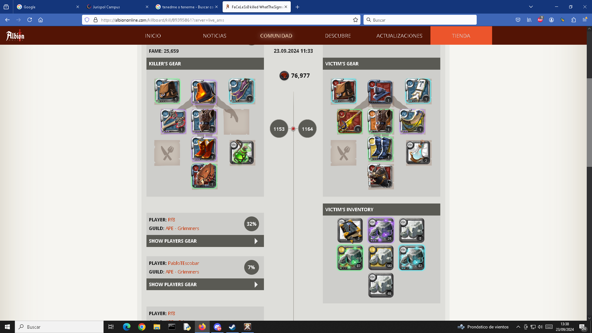

# Sistema de Control de Presencia e Incidencias
### PMDM + SGE 2026 — Entrega 1

**Alumno:** Yasser Suliman Orange  

## Indice
- [Sistema de Control de Presencia e Incidencias](#sistema-de-control-de-presencia-e-incidencias)
    - [PMDM + SGE 2026 — Entrega 1](#pmdm--sge-2026--entrega-1)
  - [Indice](#indice)
  - [1. Diagrama ER de la base de datos](#1-diagrama-er-de-la-base-de-datos)
  - [2. API REST](#2-api-rest)
    - [URL base](#url-base)
    - [Swagger UI](#swagger-ui)
    - [Tabla de endpoints](#tabla-de-endpoints)
  - [3. Sitio web](#3-sitio-web)
    - [URL de acceso](#url-de-acceso)
    - [Credenciales](#credenciales)
    - [Notas de acceso](#notas-de-acceso)


---

## 1. Diagrama ER de la base de datos


---

## 2. API REST

### URL base

https://yaliora113.eu.pythonanywhere.com

### Swagger UI  
https://yaliora113.eu.pythonanywhere.com/api/docs/swagger-ui

---

### Tabla de endpoints

Los endpoints marcados con **(JWT)** requieren la cabecera `Authorization: Bearer <token>`.

| Punto final | Método | Cuerpo JSON / Query params | Código | Respuesta |
|---|---|---|---|---|
| `/api/auth/register` | POST | `nif`, `nombre`, `apellidos`, `email`, `password` | 201 | `{ mensaje }` — 409 si NIF o email ya existen |
| `/api/auth/login` | POST | `identificador` (NIF o email), `password` | 200 | `{ access_token, usuario: { id, nombre, apellidos, email, nif, rol, id_empresa } }` |
| `/api/auth/solicitar-cambio-password` | POST | `email` | 200 | `{ mensaje }` — envía enlace de cambio de contraseña (caduca en 1h) |
| `/api/presencia/entrada` (JWT) | POST | `lat`, `lon` | 201 | `{ mensaje, id_registro, hora_entrada, distancia_m }` — valida radio GPS |
| `/api/presencia/salida` (JWT) | POST | `lat`, `lon` | 200 | `{ mensaje, id_registro, hora_entrada, hora_salida, duracion_minutos, distancia_m }` |
| `/api/presencia/estado` (JWT) | GET | — | 200 | `{ estado, hora_entrada, id_registro, ultima_salida }` — estado: `dentro` \| `fuera` |
| `/api/presencia/mis-registros` (JWT) | GET | query: `desde` (YYYY-MM-DD), `hasta` (YYYY-MM-DD), `id_trabajador`* | 200 | `{ registros: [ { id_registro, hora_entrada, hora_salida, duracion_minutos, lat_entrada, long_entrada } ], total }` |
| `/api/presencia/resumen-mensual` (JWT) | GET | query: `mes` (YYYY-MM, default: actual), `id_trabajador`* | 200 | `{ mes, id_trabajador, horas_trabajadas, horas_teoricas, horas_extra, num_fichajes }` |
| `/api/incidencias` (JWT) | POST | `descripcion`, `fecha_hora` (ISO 8601, opcional) | 201 | `{ id_incidencia, fecha_hora, descripcion }` |
| `/api/incidencias` (JWT) | GET | query: `desde` (YYYY-MM-DD), `hasta` (YYYY-MM-DD) | 200 | `{ incidencias: [ { id_incidencia, fecha_hora, descripcion } ], total }` |
| `/api/admin/incidencias` (JWT, solo Administrador) | GET | query: `desde`, `hasta`, `id_trabajador` | 200 | `{ incidencias: [ { id_incidencia, fecha_hora, descripcion, trabajador: { id, nombre, apellidos, nif } } ], total }` |

*\* `id_trabajador` solo tiene efecto si el token pertenece a un Administrador.*

---

## 3. Sitio web

### URL de acceso

```
https://yaliora113.eu.pythonanywhere.com
```

### Credenciales

| Campo | Valor |
|-------|-------|
| **Usuario (NIF o email)** | `12345678A`/`admin@rrhh.com` |
| **Contraseña** | `admin` |

### Notas de acceso

La direccion de correo electronico para comprobar que el envio de email funciona es mi email del instituto (`yaliora113@iesfuengirola1.es`).
